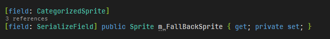
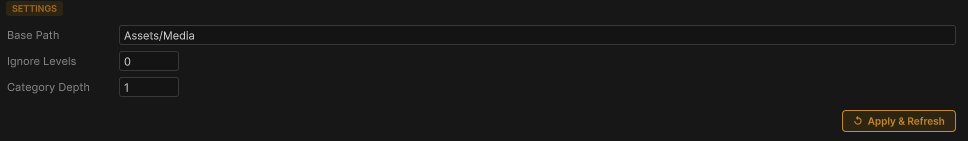

# 🛠️ Smart Sprite Picker for Unity

**Smart Sprite Picker** is a high-performance, UI Toolkit-based alternative to Unity's default Object Picker. Designed specifically for projects with complex folder structures it categorizes your assets into smart tabs and provides a much more intuitive browsing experience.

---

## ✨ Features

* **📂 Hierarchical Tab System:** Automatically converts your folder structure into easy-to-navigate tabs. It keeps the full path (e.g., `Enemies/Boss/Portraits`) while staying organized.
* **🧠 Intelligent Breadcrumbs:** A stylized dropdown allows you to jump between main categories effortlessly.
* **🔍 Global Search & "All" Mode:** Search across all subfolders or use the "All" category to see every sprite in the project at once.
* **💾 State Persistence:** Remembers your last selected category, search query, and zoom level even after restarting Unity.

---

## 📸 Preview

### Main Interface


<p align="center">
  
</p>

*Large, wrapped category buttons and clear asset previews for high-speed browsing.*

### Flexible Layout

<p align="center">
  
</p>

*The UI Toolkit-based design adapts to any window size and resolves overflow issues gracefully.*

---

## 🛠 How to Use

Use Property:

```csharp
public class MyComponent
{
   [CategorizedSprite]
   public Sprite mySprite;
}
```



1. **Select a Root:** In the settings, define your `Base Path` (e.g., `Assets/Art/Sprites`).
2. **Browse & Filter:** Use the top dropdown for main groups and the buttons below for specific sub-folders.
3. **Pick & Assign:** Click a sprite to highlight it in the Project window or automatically assign it to a `SerializedProperty` in your Inspector.

---

## ⚙️ Configuration



* **Base Path:** The starting directory for the tool.
* **Ignore Levels:** Choose how many top-level folders to skip to keep your tabs relevant.
* **Category Depth:** Determines how many folder levels are combined to form the Main Category in the top dropdown menu. Any subfolders beyond this depth will be grouped and displayed as Subcategories (the folder tabs below the dropdown).
* **Persistence:** All settings and your last view state are saved locally via `EditorPrefs`.

---

## 🚀 Installation

1. Clone this repository into your Unity project's `Assets/Plugins` folder.
2. Ensure you are using **Unity 2022.3** or newer for full UI Toolkit compatibility.

---

## 🛠 Built With

* **Unity UI Toolkit**
* **C# / Unity Editor Scripting**
* **AssetDatabase API**

---

### 📄 License

This project is licensed under the MIT License - feel free to use it in your personal or commercial projects!
